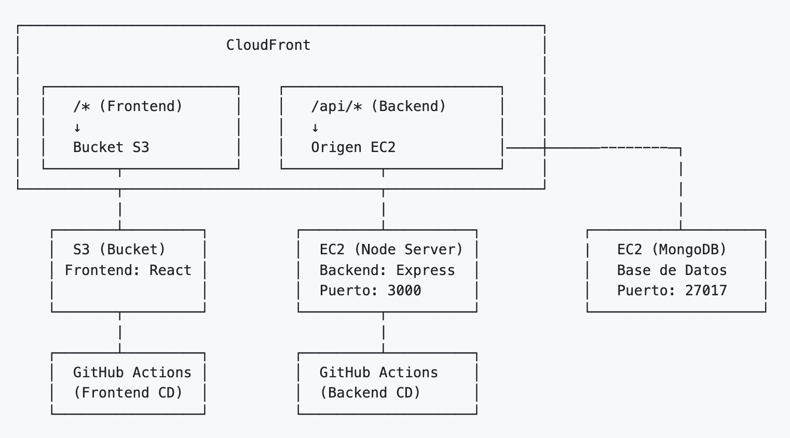

# Presentación del Proyecto DAW

## Información del Repositorio

**Repositorio GitHub:** [https://github.com/juandiegombr/daw.pi.iava](https://github.com/juandiegombr/daw.pi.iava)

**URL aplicación:** [https://d12lcsgk45eqvv.cloudfront.net/](https://d12lcsgk45eqvv.cloudfront.net/)

---

## Resumen del Proyecto

**Aplicación Web Full-Stack** desarrollada como parte del curso DAW (Desarrollo de Aplicaciones Web).

### ¿Qué es este proyecto?

Una aplicación web completa que demuestra prácticas profesionales de desarrollo, incluyendo:

- Arquitectura frontend-backend
- API RESTfull
- Containerización con Docker
- Despliegue en la nube (AWS)
- Pipeline CI/CD automatizado

---

## Capturas de Pantalla

### Listado de Sensores

### Detalle de Sensor

### Crear Sensor

### Editar Sensor

---

## Stack Tecnológico

### Backend

- **Node.js** + **Express.js** - API REST
- **MongoDB** + **Mongoose** - Base de datos NoSQL
- **CORS** - Gestión de peticiones cross-origin

### Frontend

- **React** - Biblioteca de interfaz de usuario
- **Vite** - Herramienta de desarrollo rápida con HMR

### DevOps

- **Docker** + **Docker Compose** - Containerización
- **GitHub Actions** - CI/CD automatizado
- **AWS** - Infraestructura en la nube
  - S3 para frontend estático
  - EC2 para API backend
  - CloudFront como CDN

---

## Arquitectura

La aplicación está desplegada en AWS utilizando la siguiente arquitectura:

